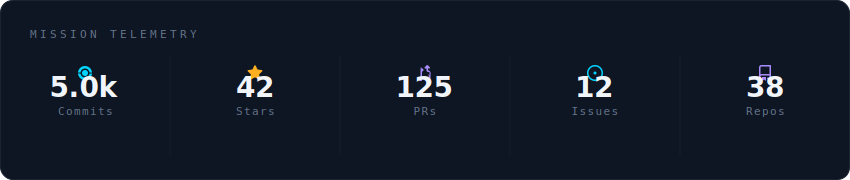

  

 

  

 

  

 

  

 

<strong>More about me</strong>

 

Building end-to-end mobile products — from native modules to App Store & Google Play releases.
6+ years delivering production apps with React Native, Kotlin and Swift.

**Currently at** afonsodev.com — Brazil (Remote)

 

  
  
  

